# Project 2: Design Journey

**For each milestone, complete only the sections that are labeled with that milestone.**

Be clear and concise in your writing. Bullets points are encouraged.

**Everything, including images, must be visible in Markdown Preview.** If it's not visible in Markdown Preview, then we won't grade it. We won't give you partial credit either. This is your warning.

## Understanding Users (Milestone 1)

**Make the case for your decisions using concepts from class, as well as other design principles, theories, examples, and cases from outside of class.**

You can use bullet points and lists, or full paragraphs, or a combo, whichever is appropriate. The writing should be solid draft quality but doesn't have to be fancy.

### Audience (Milestone 1)
> Briefly explain your site's audience. Be specific and justify why this audience is a cohesive group with regard to the Ithaca Apple Harvest Festival. .

My site's audience will be local parents of K-12 students in Ithaca. This group is likely to have similar goals and be cohesive. They'll have less need for directions to the commons, parking options, and be more interested in similar entertainment options, child-friendly group activities, et cetera. As locals, they might also be more interested in new vendors and crafters that they haven't seen before.

### User Interview Questions (Milestone 1)
> Plan the user interview which you'll use to identify the goals of your site's audience. You may use the interview template below and revise it as much as you desire. You are **required to author 3 of your own questions**..

**User Interview Briefing & Consent:** Hi, I am a student at Cornell University. I'm currently taking a class on web design and for a project, I am re-designing the web site for Ithaca's Apple Harvest Festival. I'm trying to learn more about the people that might use this site. May I ask you a few questions? It will take about 10 minutes. You are free to quit at any time.

(These questions assume you are interviewing a festival attendee at the festival. If you didn't attend the festival, you may revise the question an instead ask the participant to recall the last festival/event they attended. Do not ask them to speculate about visiting the Apple Harvest Festival. User speculation provides biased data.)

1. Please tell me a bit about yourself. You may omit any personal or private information.

2. What made you want to attend AppleFest last weekend？

3. Before you went to the festival, did you search for any details or information about it online?
3a. If yes, What information were you looking for? How did you find or try to find it?

4. When you arrived at the festival location, did you search for any details or information about the festival online?
3a. If yes, What information were you looking for? How did you find or try to find it?

5. When you were in the process of exploring the festival, did try to find any information  or details about the festival?
4a. If yes, What was that information? How did you obtain it?

6. Is there any information you wish you had known about the festival beforehand or information that you weren't able to find?

7. What was the most useful piece of information that you found online about AppleFest? How did this information change your experience at the event?

8. Did you visit AppleFest with your child(ren)? Was there anything you had to plan differently when going with them, compared to going on your own? If so, what was it?

9. Have you been to AppleFest before? If you have, how was your most recent visit different from  visits in the past? Did these changes affect your experience?

...

n. What haven't I asked you today that you think would be valuable for me to know?

**After the interview:** This was really helpful. Thank you so much for agreeing to speak with me today. Have a great day!

### Interview Notes (Milestone 1)
> Interview at least 3 people from your audience. Take notes and include those notes here. Make sure to include a brief description of each interviewee.

**Interviewee 1:**

Description: Matthew, my apartment's USPS mailman - he has a son in middle school. Visited on Sunday.

Notes:

Ithaca local, irregular work schedule because of rotating off days. He spends a lot of time with his son after work, and occasionally brings him along on errands.

Son wanted to go to Applefest for food (sweets, apple turnover), which isn't normally available at places like the farmer's market. Applefest was cancelled last year due to COVID, so they couldn't go.

Looked for hours, some vendors they liked in the past, and hours of some nearby shops/restaurants to go after the festival. Searched for it on Google/mobile phone, also asked wife.

No, didn't check again on arrival/during festival, they found everything they needed.

When going with son, he spends more time than if going alone. Had to plan for lunch beforehand.

Much less crowded, less people, probably due to bad weather.

**Interviewee 2:**

Description: Monica, my neighbor, has two sons (7, 10), moved to Ithaca a few years ago from Buffalo. Attended on Saturday.

Notes:

Works at Cornell, moved to current house last year. Likes Ithaca/Cornell.

They attend a lot of events around town like Applefest, especially since the move was recent. Wanted to get kids out of the house.

Heard about Applefest through word of mouth, knew about it but didn't attend previously.

Looked it up online to see how big it was, hours, how much time it would take to explore, etc. Wanted to see if there were any activities, games, etc. for the kids.

Looked up map to see the the details upon arrival.

Wish she knew how crowded it would be, had difficulty getting a table at nearby restaurant for dinner. Lots of vendors had long lines.

Would probably not have planned as thoroughly if she went alone, but would've spent more time there, wanted to get kids home early.

Haven't been to Applefest before, enjoyed experience.

**Interviewee 3:**

Description:

Bun (?), Thai immigrant, met online through NextDoor. Has two daughters, she was a bit more confused about some questions.

Notes:

Went with daughters, they enjoyed the festival food, get excited about liveliness, etc. Husband made most plans for trip.

Wanted to enjoy nice weather/sun, go shopping. Had friends who were vending at the festival.

Didn't look up anything specifically, walked to site.

There were many people at the site, it was crowded. Did not see any performances/music.

N/A

Bringing children meant checking for bathrooms, having to be more flexible if the kids are tired/hungry/not feeling well, having to keep an eye on them.

Enjoyed the experience, didn't go in the past.

### Goals (Milestone 1)
> Analyze your audience's goals from your notes above. List each goal below. There is no specific number of goals required for this, but you need enough to do the job (Hint: It's more than 1 and probably more than 2).

Goal 1: Find a good time to visit, not too crowded or empty
- **Design Ideas and Choices**
  - Make timetable/hours for event easy to see
  - Organize content based on what users are most interested in seeing at the festival
  - Use minimal, clean design so user can focus on information
  - Allow user to see more content at once, reduce whitespace

- **Rationale & Additional Notes**
  - Decision making requires balancing different aspects, so the site should not be distracting.
  - Lots of whitespace makes it harder to skim/browse through information efficiently.

Goal 2: Eat at sit-down restaurants with minimal wait time
- **Design Ideas and Choices**
  - Add map of nearby restaurants with nearby parking so user can plan where to eat beforehand
- **Rationale & Additional Notes**
  - Plan page should allow user to plan things not directly related to event, like where to eat afterwards.

Goal 3: Visit specific vendors & see what each is selling
- **Design Ideas and Choices**
  -  Categorize and name all vendors attending.
  - Designated page for shopping content
  - Have vendors (food, shopping) and performers (entertainment) in two distinct sections in the same page
- **Rationale & Additional Notes**
  - Shopping and entertainment are similar goals when planning, so they should be on the same page, but users are likely to plan each one separately

Goal 4: Easily see changes from previous years
- **Design Choices**
  - Include history, snippets of previous years in sites
  - Announcement/callout for any major changes, so returning visitors will see it right away

- **Rationale**
  - Having one designated attention grabbing element delivers important information faster than nesting it with everything else.

## Content Planning (Milestone 1)

Plan your site's content.

### Your Site's Planned Content (Milestone 1)
> List the content you plan to include your personal website. This should be a comprehensive list.

- Hours/days that event is open
- Performance/event schedule
- Artist lineup
- Map of Commons
- Parking information
- List of vendors w/ categories
- COVID guidelines
- Title
- Photos of event
- PHotos of vendors and items
- FAQ's about event
- Background info blurb

### Content Justification (Milestone 1)
> Explain (about a paragraph) why this content is the right content for your site's audience and how its addressed their goals..

 My content is heavily based around allowing visitors to plan ahead, and experience the festival efficiently. The users I spoke with all work full time, and expressed similar feelings of wanting to spend quality time with kids, but having limited time or availability. So the information like wait time for vendors/restaurants, and detailed info about what each vendor sells, rest areas, promotions - so parents can plan the day in advance, and spend less time wandering around. This is especially helpful if a user is looking for something specific, the site allows them to see if it's available beforehand. If they don't remember the name of a vendor they saw in previous years, they can also easily check previous year's sites in the archives section.

## Information Architecture (Milestone 1)

### Content Organization (Milestone 1)
> Document your iterations of card sorting here.
> Include photographic evidence of each iteration of card sorting and description of your thought process for each iteration.

#### Sort 1
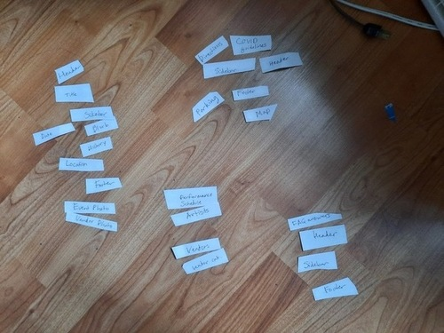
4 pages - One for performance and vendor, which are the main attractions, one for information about guidelines and possibly useful details for planning the actual trip, a FAQ page, and a home page with more photos and trivia information about the event.

#### Sort 2
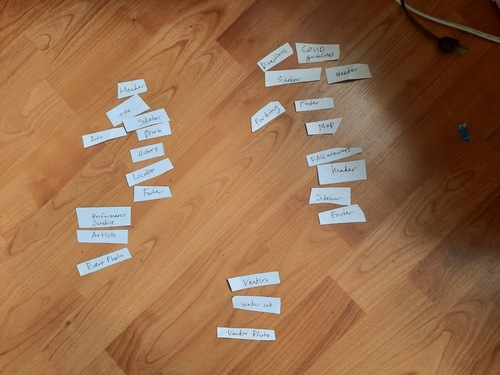

3 pages - one designated for vendors, since that was a major need expressed by the audience.

The home page includes more time-sensitive information like event hours, performance schedules, etc., are combined into one page, since they vary from day to day.

FAQs and other technical planning details like parking are in one page, since they're less interest-based and more need-based.

#### Sort 3
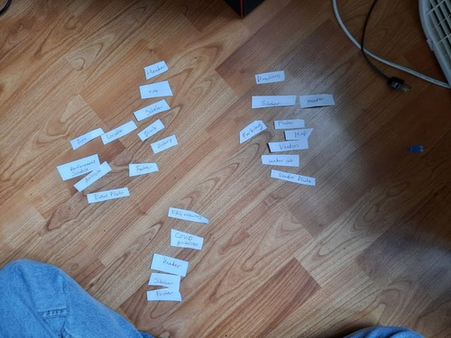

Same as 2, the home page includes more time-sensitive information like event hours, performance schedules, etc., are combined into one page, since they vary from day to day. COVID guidelines are in FAQs, since they aren't strict requirements, and may only be important to extra COVID-cautious visitors.

Vendors are included with other planning details, so visitors can select which vendors to visit while planning the itinerary.

1. Home
- Title
- Header with blurb and date/location
- Photos of event
- Callout/announcement
- Hours/days that event is open
- COVID guidelines
- Sidebar menu
- Footer menu

2. Performers and vendors
- Header with blurb and date/location
- Performance/event schedule
- Performance timetable
- Artists performing at event
- List of vendors w/categories
- Sidebar menu
- Footer

3. Planning your visit
- Header with blurb and date/location
- Map of event
- directions
- Parking information
- Public Transit
- Sidebar menu
- Footer menu

4. FAQ
- Header with blurb and date/location
- list of questions
- list of answers
- links to other resources
- Sidebar menu
- Footer menu

### Final Content Organization (Milestone 1)
> Which iteration of card sorting will you use for your website?

My final card sort will be used. It minimizes the number of pages while still keeping the content clearly organized by the purpose it will help the audience achieve.

> Explain how the final organization of content is appropriate for your site's audiences and their goals.

The final organization helps the audience navigate based on their planning needs during their visit. The users I interviewed had different needs when it came to planning - some were interested in having the best experience by finding their preferred festival food, vendors, and events beforehand. Others were interested in finding detailed information about accommodations to prevent stressful situations. For example, finding bathrooms, or finding specific vendors so they wouldn't be stuck in line for a long time.

### Navigation (Milestone 1)
> Please list the pages you will include in your personal website navigation.

- Home
- Vendors and Performers
- Plan Your Visit

> Explain why the names of these pages make sense for your site's audience and their goals.

The home page includes a rundown of the event and what it is, and the most general but important information will be listed here (hours, dates). It includes information that anyone interested in visiting would be likely to need like the date/hours and location.

The Vendors and Performers page lists detailed information about what can be purchased, consumed, or viewed at the festival. This allows the visitor to plan around what they're interested in.

The Plan Your Visit includes logistical information, and allows users to plan around factors like how to get there, places to rest or explore after the festival, parking information, and public transit information.

## Visual Theme (Milestone 1)
> Discuss several (more than two) ideas about styling your site's theme. Explain why the theme ideas are appropriate for your target audiences. Note the theme you selected for you site and why it's appropriate for the audience and their goals.

1. The site will be fall colored, with bold sans-serif fonts. The text will be on a white background, and colors are incorporated as accents (buttons, headings). These choices allow attention to be captured without losing readability/making the site more confusing. Title of the site will be in a fancier script font. Square, brightly colored images of event.

2. Site will only have one main and two accent colors, also orange and red fall colors, more muted/desaturated, text is smaller, sans-serif, uniform font throughout. Close-up photos of items sold by vendors, details.  More "utilitarian" feeling, with less of a goal to attract people's attention, and more allowing people to find information easily (since my audience most likely has heard of or experienced Applefest before).

3. Distinctly defined sections with image overlays on each section (ex: a car png for directions/parking). Less standard sans serif fonts, that are more fun and eye catching. Bold colors that are distinct for each section, with more muted colors in the background.

I selected the second theme because my audience is using the site to plan, and have presumably already decided to attend. So I want them to be able to find important information easily, rather than be distracted by bright colors and attention-grabbing elements.

## Design (Milestone 1)

Document your site's layout.

### Layout Exploration (Milestone 1)
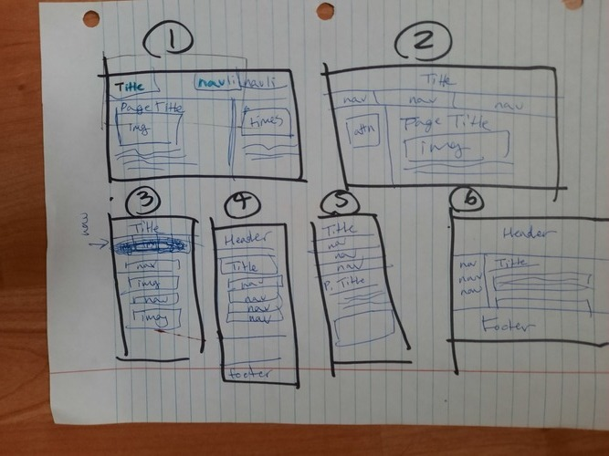

In the top sketches, I am mainly exploring how to place the navigation menu alongside the content. For example, I could keep the menu items inline with the title, or have them in a sidebar.

In the bottom sketches, I explore mobile navigation. I'm keeping the content mostly in one column, with the exception of things like timetables.

### Final Design (Milestone 1)
> Include the final sketches for each of your pages.
> The sketches must include enough detail that another 1300 student could implement them.
> Provide a explanation for each sketch.

**Mobile Design:**

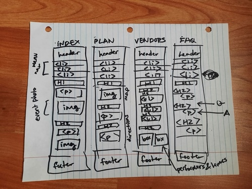

The header, footer, and navigation menu are uniform throughout the 4 pages. In index, all content spans the device width. In Vendors, performers and times are separated into 2 columns. Image content also spans the device width, and captions are placed below.

The navigation menu items are stacked in a single column.

**Desktop Design:**

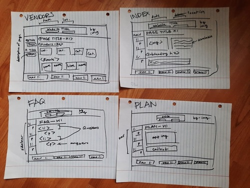

The header, footer, and navigation menu are uniform throughout the 4 pages. The footer has a row of navigation links, and the sidebar arranges the menu items in a column. The header has a background image with a box overlay containing main details like the site title, event date, and event location.

In the Vendors page, each category is its own box, and all categories are displayed in a single row. The sidebar menu has less width than the main page content.

### Design Rationale (Milestone 1)
> Explain why your design is appropriate for your audience. Specially, why does your content organization, navigation, and site design/layout meet the goals of your users? How did you employ design patterns to improve the familiarity of the site for your audience?

My site is colorful and welcoming, yet still utilitarian with minimal "decision making" by the users. The layout separates the information so that the more important information is central/larger in size. I use very few pages in the site, and focus on efficiently organizing the information on every page. The pages I have each serve a specific purpose/action the user needs to do at the event, and can be separated into "useful before the event" (planning) and "useful during the event" (vendors/performers). The text content is readable, and uses contrast between the light background and dark text to ensure users can easily read the content. Photos are used more as an accessory or accent, and do not dominate the page, as they serve no practical purpose.

## User Testing (Final Submission)

### Finished Desktop & Mobile Website (Final Submission)
> Include screenshots of both the desktop and mobile version of your site that you will be using for user testing. (We need to see the "before" testing version of your site.)

**Mobile Screenshots:**

##### Home
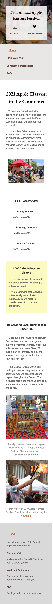

##### Plan Your Visit
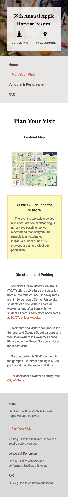

##### Vendors
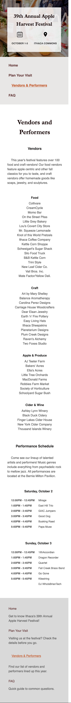

#####FAQ
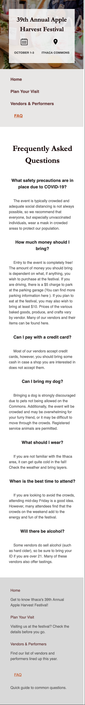

**Desktop Screenshots:**
##### Home
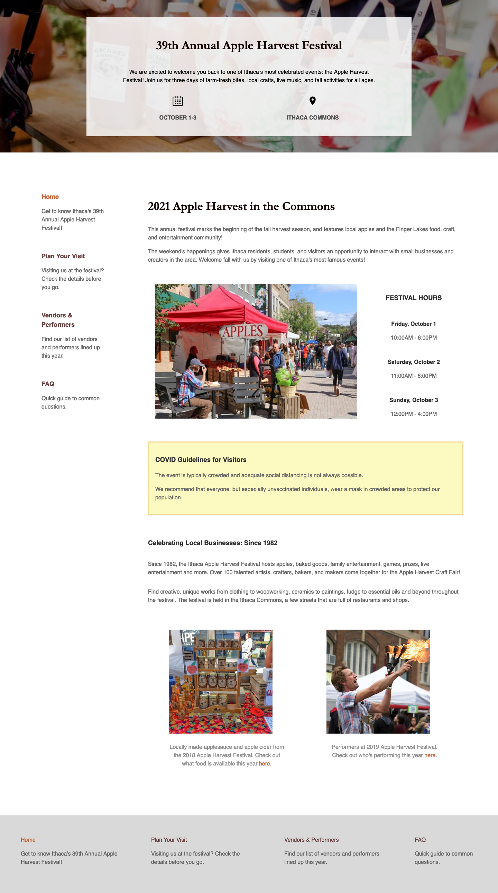

##### Plan Your Visit
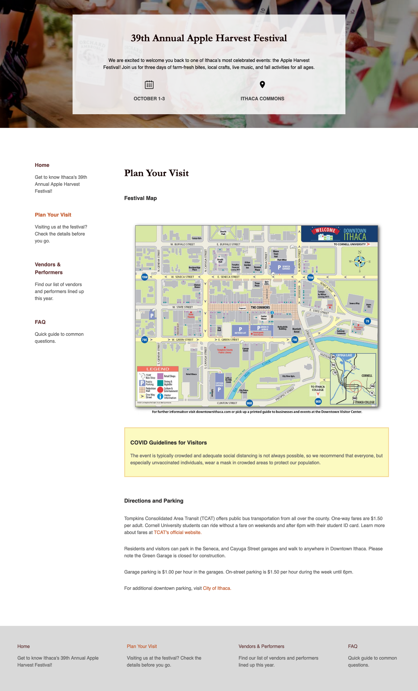

##### Vendors
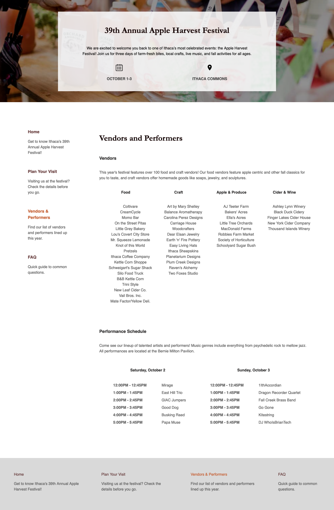

#####FAQ
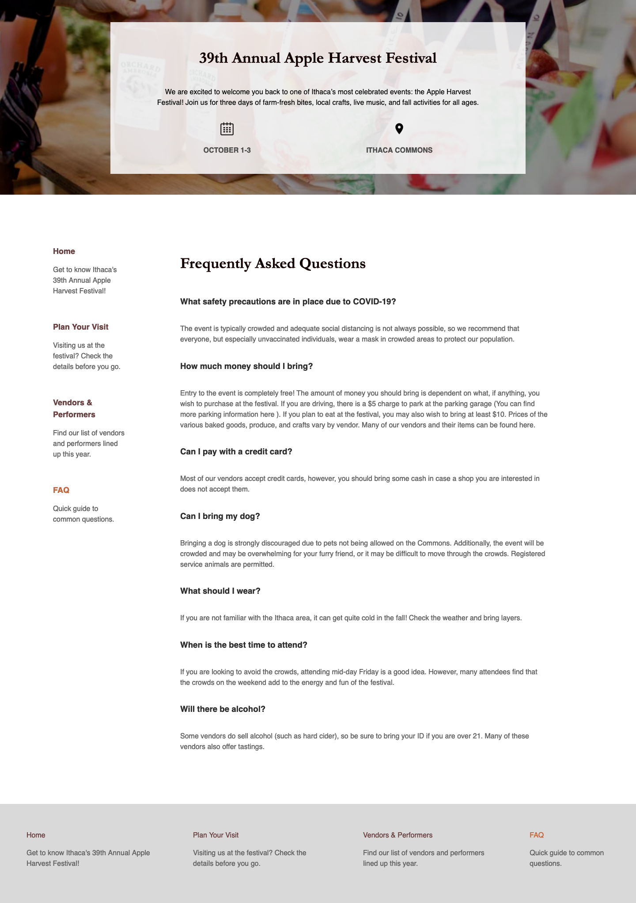

### User Testing Tasks (Final Submission)
> Plan out your user testing tasks before doing your user testing. These must be actual user testing tasks. **Tasks are not questions!**

1. You attended Applefest a few years back and remember trying some tasty kettle corn from B&B Kettle Corn. Find out if they'll be at the festival again this year.

2. You arrived at Applefest and realized that you forgot to bring cash. Find out if vendors here accept credit card.

### User 1 - Testing Notes (Final Submission)
> When conducting user testing, you should take notes during the test. Place your notes here.

1. Reads through home page, scrolls a bit down.

Looks back at menu/header, scrolls to bottom photos.

Carefully reads photo captions, and paragraph text.

Scrolls to menu, reads descriptions, clicks vendors page.

Zooms in
Reads for a long time, finds one kettle corn shop, can't find the other/giving up

Finds B&B

Says there's too much text in vendor categories

2. Clicks back to home page, then reads through content quickly

Clicks to Plan pages, scrolls to bottom

Rereads Vendor page

Clicks to FAQ, reads top 3 questions, finds credit card Q

### User 1 (Final Submission)
> Using your notes from above, describe your user by answering the questions below.

1. Who is your user, e.g., where does the user come from, what is the user's job, characteristics, etc.?

My user is Matthew. He's 43 and works for USPS, services a route in northern Ithaca. He has a son in middle school. He spends off days with his son, and travels upstate every few weeks to spend time with family. He was one of the users I interviewed earlier. He is very friendly and spends lots of time interacting with locals and Cornell students on his route.

2. Does the user belong to your audience of the site? (**Yes** / No)

Yes. He's busy but tries to spend time with his son on off days. My site's audience is parents who want to plan a trip to Applefest before going, so they can get the most out of their trip.

### User 1 (Final Submission)
> Report the results of your user's test. You should explain **what the user did**, describe the user's **reaction/feedback** to the design, **reflect on the user's performance**, determine what **re-design choices** you will make **for EACH task**. You can also add any additional comments.

Task: You attended Applefest a few years back and remember trying some tasty kettle corn from B&B Kettle Corn. Find out if they'll be at the festival again this year.

- **Did you evaluate the desktop or mobile design?**
  - Desktop
- **How did the user do? Did they meet your expectation?**
  - They spend a lot more time reading the text content than I expected. I thought they would just skim through irrelevant sections.
- **User’s reaction / feedback to the design** (e.g., specific problems or issues found in the tasks)
  - They found the vendors page to be difficult to read, and commented on the long list. They were a bit hesitant on clicking to different pages, and scrolled a few times to make sure they were clicking correctly. Got stuck at the very end because there were multiple kettle corn vendors.
- **Your reflections about the user’s performance to the task**
  - He was a bit hesitant and I think it may have been because I was watching and taking notes. He seemed deliberate, and read everything carefully before clicking. I don't know if he would have responded the same if he were using the site alone, since he also considered clicking the other pages (Plan Your Visit).
  - Content is also important for user friendly sites. He was unable to find the kettle corn vendor provided since he thought there would only be one, and also because the list wasn't alphabetical.
- **Re-design choices**
  - Alphabetize long text lists, reduce or shorten unnecessary text. Add more spacing between vendor category items, use larger or bolder font. Possibly split list into subsections.
- **Additional Notes**
  - The lighter color, and having all the text bunched up, makes it much harder to find a single item from the list. Alphabetizing makes it easier to find specific vendors if you know their name.

2. You arrived at Applefest and realized that you forgot to bring cash. Find out if vendors here accept credit card.

- **Did you evaluate the desktop or mobile design?**
  - Desktop
- **How did the user do? Did they meet your expectation?**
  - Went through pages more quickly this time to solve task, did well/met expectations
- **User’s reaction / feedback to the design** (e.g., specific problems or issues found in the tasks)
  - Confused why vendor info was not on vendor page. Didn't know what info was in FAQ page
- **Your reflections about the user’s performance to the task**
  - Much quicker now that he was familiar with the site
  - He had different assumptions for how information would be categorized than I did, assumed FAQ info would be in their respective pages
- **Re-design choices**
  - Change navigation item descriptions to reflect what's in each page. Reorder navigation to prioritize FAQ. Have preview on top of page indicating what's in the page?
- **Additional Notes**
  - The current descriptions for nav items is not enough, so users should either know what's in a page before they click, or immediately after. Not sure if faster task completion reflects user friendliness.

### User 2 - Testing Notes (Final Submission)
> When conducting user testing, you should take notes during the test. Place your notes here.

1. Scrolls to bottom of home page, slowly, then up to menu quickly. Clicks through site pages in order very quickly, skimming through content

Clicks to Vendors page, pauses on Food category, then reads through and finds B&B

2. Scrolls to menu, clicks Vendor page and scrolls to bottom quickly, then jumps to FAQ

"remembered seeing money questions earlier"

### User 2 (Final Submission)
> Using your notes from above, describe your user by answering the questions below.

1. Who is your user, e.g., where does the user come from, what is the user's job, characteristics, etc.?

My user is a graduate Cornell student. He is my friend's housemate. He studies math, and lived in Ithaca for 2 years so far. He's 24, and grew up in North Virginia. He visited Applefest alone.

2. Does the user belong to your audience of the site?

No, but I had him complete a task that the audience would likely do (finding specific vendors) that he wouldn't necessarily do. He's also spent a while in Ithaca, so has something in common with my target audience.

### User 2 (Final Submission)
> Report the results of your user's evaluation. You should explain **what the user did**, describe the user's **reaction/feedback** to the design, **reflect on the user's performance**, determine what **re-design choices** you will make **for EACH task**. You can also add any additional comments.

Task: You attended Applefest a few years back and remember trying some tasty kettle corn from B&B Kettle Corn. Find out if they'll be at the festival again this year.

- **Did you evaluate the desktop or mobile design?**
  - Desktop
- **How did the user do? Did they meet your expectation?**
  - He did really well, and found information that he considered useful for future trips to Applefest as well. He was able to complete tasks quickly, and navigate through the site without guidance.
- **User’s reaction / feedback to the design** (e.g., specific problems or issues found in the tasks)
  - Navigating between pages made him jump back to the top of the page each time, and spend more time scrolling. He tried clicking on some items that weren't meant to be clickable (photos, icons).
- **Your reflections about the user’s performance to the task**
  - He was able to use the site to effectively complete the task, but there were still confusing aspects for him (icons were not clickable). Although he completed tasks quickly, he also clicked around/did a lot of unnecessary actions that took up time.
  - He also spent a while looking through the list for the specific B&B Kettle Corn vendor
- **Re-design choices**
  - Have icons link to relevant pages (date to index page with timetable, location to plan page with map)
  - Use larger fonts with more spacing between lines, or subcategorize vendors within each category
- **Additional Notes**
  - Subcategories help in the case of having multiple vendors selling similar things (kettle corn). Icons refer to content that's already on the site, so it would be helpful to link them to those pieces of content.

You arrived at Applefest and realized that you forgot to bring cash. Find out if vendors here accept credit card.

  - **Did you evaluate the desktop or mobile design?**
    - Desktop
  - **How did the user do? Did they meet your expectation?**
    - They were able to complete the task very quickly since they saw the question in the FAQ during the task earlier.
  - **User’s reaction / feedback to the design** (e.g., specific problems or issues found in the tasks)
    - FAQs aren't categorized, so he didn't know where exactly the question and answer were.
  - **Your reflections about the user’s performance to the task**
    - Was able to use site to complete tasks, but he suggested that this task may not be realistic.
    - Key information should be highlighted. He read the answer and jumped to the previous question in the FAQs, since it said to bring some money, but didn't specify.
  - **Re-design choices**
    - Condense FAQ questions or make them more concise, change color or weight of important info in the answers.
  - **Additional Notes**
    - FAQ's are not organized currently, but user was able to find it quickly since the credit card question was close to the top.

### User 3 - Testing Notes (Final Submission)
> When conducting user testing, you should take notes during the test. Place your notes here.

1. Scrolls through home page, then back to nav and Plan page. Looks through map and legend. Scrolls to bottom, uses footer to navigate to find vendor.

Reading description for categories.

Clicks Vendors, reads through list, then jumps to bottom, then back up.

Finds B&B at bottom of list.

Scrolls to bottom, rereads footer, goes back to index.

2. Clicks Plan page, briefly scrolls, then back to navigation.

Clicks Vendor Page, goes past lists quickly, then to bottom

Goes back to Plan and Home

Goes to top, to FAQ. Skims questions, finds credit card question.

### User 3 (Final Submission)
> Using your notes from above, describe your user by answering the questions below.

1. Who is your user, e.g., where does the user come from, what is the user's job, characteristics, etc.?

My user is a high school student from NYC, who I found through an alumni Facebook group. She grew up in Queens, and has never been to Ithaca or knows anything about AppleFest.

2. Does the user belong to your audience of the site?

No, but this user gives me insight into how someone who is unfamiliar with Ithaca and Applefest would use the site.

### User 3 (Final Submission)
> Report the results of your user's evaluation. You should explain **what the user did**, describe the user's **reaction/feedback** to the design, **reflect on the user's performance**, determine what **re-design choices** you will make **for EACH task**. You can also add any additional comments.

Task: 1. You attended Applefest a few years back and remember trying some tasty kettle corn from B&B Kettle Corn. Find out if they'll be at the festival again this year.

- **Did you evaluate the desktop or mobile design?**
  - Mobile
- **How did the user do? Did they meet your expectation?**
  - They took much longer to complete the task. The vertical format made the lists of vendors harder to skim, and she had to scroll more aggressively. She was able to complete the task.
- **User’s reaction / feedback to the design** (e.g., specific problems or issues found in the tasks)
  - Having long columns prevented her from reading stuff at the bottom/below the lists
  - Was frustrated at length of vendor page
- **Your reflections about the user’s performance to the task**
  - Took a while to complete, was confused about navigation - not sure if she knew top and bottom/footer navigation was the same.
- **Re-design choices**
  - Use two columns for long columns to break up content, make sure user can easily see each section when skimming.
- **Additional Notes**
  - Two columns help reduce whitespace, the names of vendors are fairly short so it won't cause horizontal scrolling.

Task: 2. You arrived at Applefest and realized that you forgot to bring cash. Find out if vendors here accept credit card.

- **Did you evaluate the desktop or mobile design?**
  - Mobile
- **How did the user do? Did they meet your expectation?**
  - Task was completed, but caused frustration. Took much longer to complete, may be impractical when trying to find this information in real time at the festival.

- **User’s reaction / feedback to the design** (e.g., specific problems or issues found in the tasks)
  - Confused by navigation, having to scroll extensively to reach navigation menu. Disoriented.
- **Your reflections about the user’s performance to the task**
  - I'm not sure if she would have completed the task alone, if she didn't feel pressured to because I was taking notes.
- **Re-design choices**
  - Add links to break the scrolling periodically, so user doesn't have to go all the way to the top or bottom to switch pages.
- **Additional Notes**
  - Helps to minimize physical motion when navigation, but also have to keep content organized and not too cluttered.

### Potential Changes Based on User Testing (Final Submission)
> What changes would you make to your design based on user testing?

- Size up and darken the font in the vendor list.
- Reorder content so some FAQ's are placed in relevant pages, or linked in relevant points.
-  Break up large chunks of text content on mobile.
- Add more photos of event (users suggested)
- If list of items is unordered, add subcategories so users can skim more easily.

## Self-Reflection (Final Submission)
> This was the first project in this class where you were able to follow a user-centered design process from start to finish. What did you learn from this experience?

I learned that people have very different responses to the same designs, and that it's easy to be biased as the designer, since I know the site and content well, but the user doesn't. I was surprised at how longed  the users to complete the task most of the time, but then I realized that it's because I've used/browsed through the site dozens of times in the process of designing it.

> Take some time here to reflect on how much you've learned since you started this class. It's often easy to ignore our own progress. Take a moment and think about your accomplishments in this class. Hopefully you'll recognize that you've accomplished a lot and that you should be very proud of those accomplishments!

I am happy with how clean and professional the site looks. My first site looked very retro, and like a personal project. I also learned a lot about layout and how to use it effectively. I'm happy with how it turned out, and I think it's a big step to have confidence in being able to design for a client in the next project.
